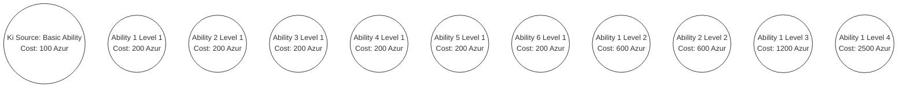

# Project-Stellar-ability-trees

```mermaid
graph TD;
    classDef default fill:#ffffff,stroke:#000000,stroke-width:1px;
    classDef abilityLevel fill:#f9f9f9,stroke:#333333,stroke-width:1px;

    basic(("Ki Source: Basic Ability\nCost: 100 Azur"))
    L1A1(("Ability 1 Level 1\nCost: 200 Azur"))
    L1A2(("Ability 2 Level 1\nCost: 200 Azur"))
    L1A3(("Ability 3 Level 1\nCost: 200 Azur"))
    L1A4(("Ability 4 Level 1\nCost: 200 Azur"))
    L1A5(("Ability 5 Level 1\nCost: 200 Azur"))
    L1A6(("Ability 6 Level 1\nCost: 200 Azur"))

    L2A1(("Ability 1 Level 2\nCost: 600 Azur"))
    L2A2(("Ability 2 Level 2\nCost: 600 Azur"))

    
    L3A1(("Ability 1 Level 3\nCost: 1200 Azur"))


    L4A1(("Ability 1 Level 4\nCost: 2500 Azur"))


```
